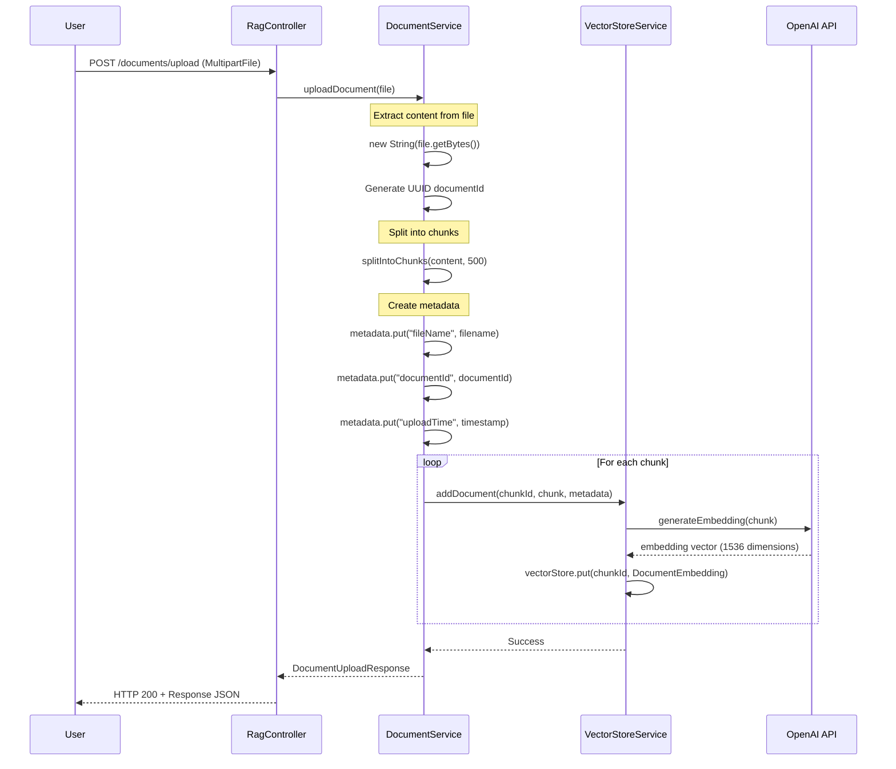
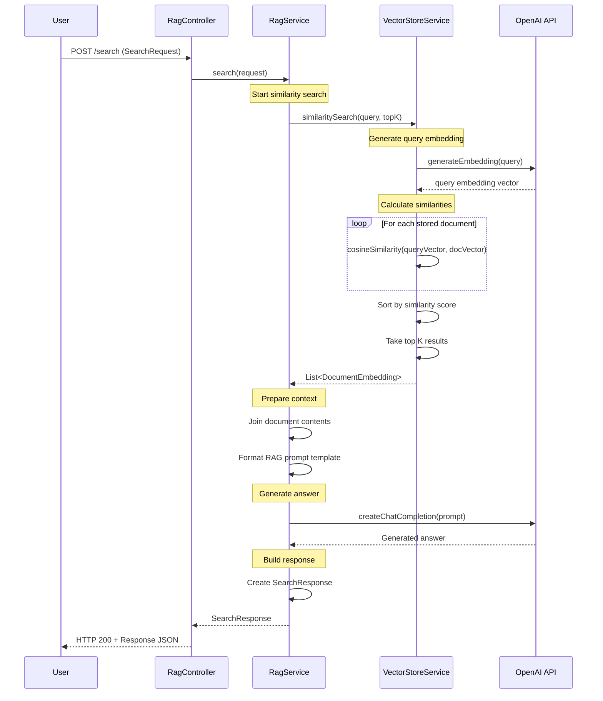
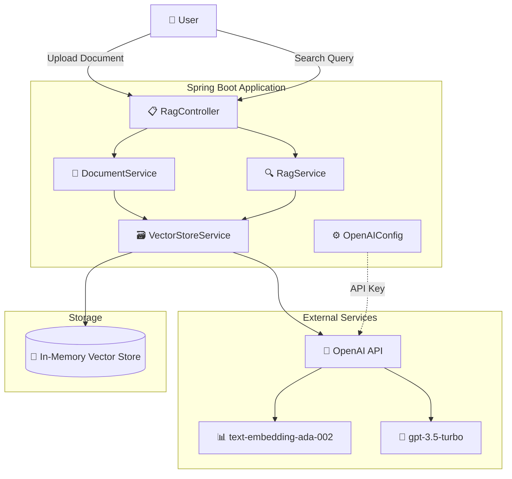
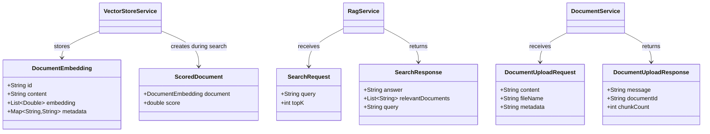
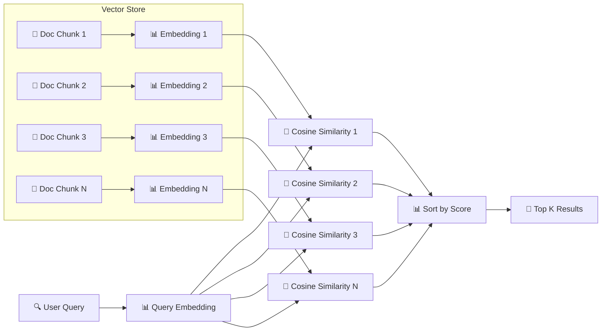
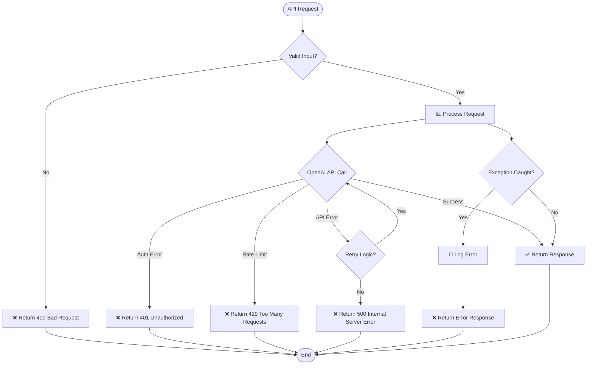
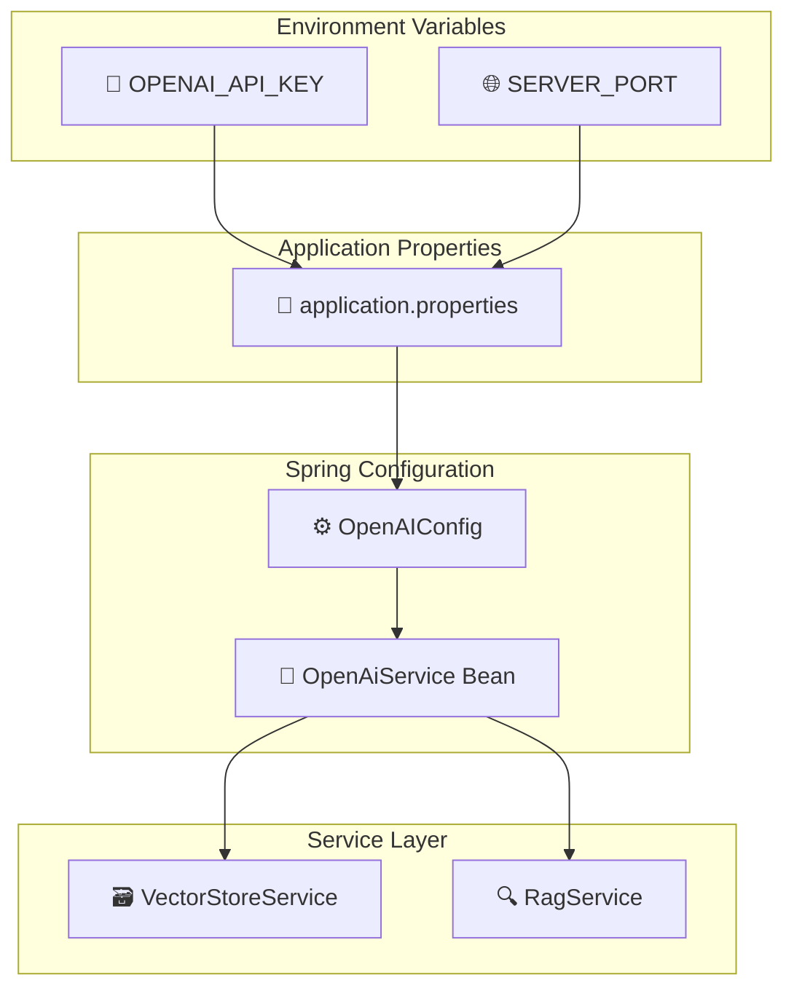

# RAG API Flow Diagrams

## Document Upload Process Flow

## Search Process Flow

## System Architecture Diagram

## Data Structure Diagram

## Vector Similarity Calculation

## Error Handling Flow

## Configuration Dependencies

