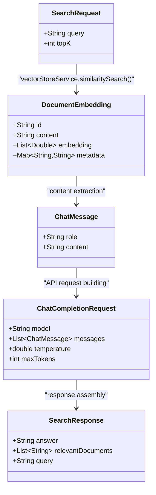

# RagService Search Method - Code Flow Visualization

## Visual Code Flow Diagram

```mermaid
flowchart TD
    A[🔍 search(SearchRequest request)] --> B[📝 Log: 'Searching for: query']
    
    B --> C[🔗 vectorStoreService.similaritySearch()]
    
    C --> D{📊 Documents Found?}
    
    D -->|No| E[❌ Return empty response<br/>'No relevant documents found']
    
    D -->|Yes| F[📝 Log: 'Found X similar documents']
    
    F --> G[📄 Extract content from documents<br/>stream().map(getContent)]
    
    G --> H[🔗 Join with double newlines<br/>collect(joining('\\n\\n'))]
    
    H --> I[📝 Create RAG prompt<br/>String.format(template, context, query)]
    
    I --> J[🤖 generateAnswer(prompt)]
    
    J --> K[💬 Create ChatMessage list]
    K --> L[⚙️ Configure ChatCompletionRequest<br/>model: gpt-3.5-turbo<br/>temperature: 0.7<br/>maxTokens: 500]
    L --> M[🌐 openAiService.createChatCompletion()]
    
    M --> N{✅ API Success?}
    
    N -->|No| O[❌ Log error<br/>Return error message]
    N -->|Yes| P[📤 Extract answer content<br/>getChoices().get(0).getMessage()]
    
    P --> Q[✂️ Create document snippets<br/>Truncate to 200 chars + '...']
    
    Q --> R[🏗️ Build SearchResponse<br/>answer + relevantDocuments + query]
    
    R --> S[📬 Return SearchResponse]

    style A fill:#e1f5fe
    style E fill:#ffebee
    style O fill:#ffebee
    style S fill:#e8f5e8
```

## Step-by-Step Code Execution Flow

### Phase 1: Input Processing & Logging
```java
// STEP 1: Method Entry
public SearchResponse search(SearchRequest request) {
    
    // STEP 2: Log the incoming query
    log.info("Searching for: {}", request.getQuery());
    // Example output: "Searching for: What are wire transfer fees?"
```

### Phase 2: Vector Similarity Search
```java
    // STEP 3: Perform vector similarity search
    List<VectorStoreService.DocumentEmbedding> similarDocuments = 
        vectorStoreService.similaritySearch(request.getQuery(), request.getTopK());
    
    // Internal process in vectorStoreService:
    // 3a. Generate query embedding: [0.123, -0.456, 0.789, ...]
    // 3b. Calculate cosine similarity with all stored documents
    // 3c. Sort by similarity score (highest first)
    // 3d. Return top K documents
```

### Phase 3: Validation & Early Exit
```java
    // STEP 4: Log results count
    log.info("Found {} similar documents", similarDocuments.size());
    
    // STEP 5: Check if any documents were found
    if (similarDocuments.isEmpty()) {
        // STEP 6: Early return for empty results
        return SearchResponse.builder()
            .answer("No relevant documents found.")
            .relevantDocuments(List.of())
            .query(request.getQuery())
            .build();
    }
```

### Phase 4: Context Assembly
```java
    // STEP 7: Extract content from all similar documents
    String context = similarDocuments.stream()
        .map(VectorStoreService.DocumentEmbedding::getContent)
        // Transform: DocumentEmbedding -> String content
        .collect(Collectors.joining("\n\n"));
        // Join: "content1\n\ncontent2\n\ncontent3"
```

### Phase 5: Prompt Construction
```java
    // STEP 8: Create structured prompt using template
    String prompt = String.format(RAG_PROMPT_TEMPLATE, context, request.getQuery());
    
    // Result example:
    // "Use the following context to answer the question...
    //  Context: [joined document contents]
    //  Question: What are wire transfer fees?
    //  Answer:"
```

### Phase 6: AI Answer Generation
```java
    // STEP 9: Generate answer using OpenAI
    String answer = generateAnswer(prompt);
    
    // Internal generateAnswer() process:
    private String generateAnswer(String prompt) {
        try {
            // 9a. Create chat message
            List<ChatMessage> messages = new ArrayList<>();
            messages.add(new ChatMessage(ChatMessageRole.USER.value(), prompt));
            
            // 9b. Configure API request
            ChatCompletionRequest request = ChatCompletionRequest.builder()
                .model("gpt-3.5-turbo")
                .messages(messages)
                .temperature(0.7)
                .maxTokens(500)
                .build();
            
            // 9c. Call OpenAI API
            ChatCompletionResult result = openAiService.createChatCompletion(request);
            
            // 9d. Extract response
            return result.getChoices().get(0).getMessage().getContent();
            
        } catch (Exception e) {
            // 9e. Error handling
            log.error("Error generating answer", e);
            return "Error generating answer: " + e.getMessage();
        }
    }
```

### Phase 7: Response Preparation
```java
    // STEP 10: Create document snippets for response
    List<String> relevantDocs = similarDocuments.stream()
        .map(doc -> {
            String content = doc.getContent();
            // Truncate if longer than 200 characters
            return content.length() > 200 
                ? content.substring(0, 200) + "..." 
                : content;
        })
        .collect(Collectors.toList());
```

### Phase 8: Response Assembly
```java
    // STEP 11: Build and return final response
    return SearchResponse.builder()
        .answer(answer)                    // AI-generated answer
        .relevantDocuments(relevantDocs)   // Source document snippets
        .query(request.getQuery())         // Echo original query
        .build();
}
```

## Data Transformation Flow

```mermaid
graph LR
    A[👤 User Query<br/>'What are fees?'] --> B[📊 Query Vector<br/>[0.123, -0.456, ...]]
    
    B --> C[🔍 Similarity Scores<br/>Doc1: 0.89<br/>Doc2: 0.67<br/>Doc3: 0.34]
    
    C --> D[📋 Top K Docs<br/>List&lt;DocumentEmbedding&gt;]
    
    D --> E[📄 Context String<br/>'Fee info 1\n\nFee info 2...']
    
    E --> F[🤖 RAG Prompt<br/>'Use context...\nQuestion: ...']
    
    F --> G[💬 AI Answer<br/>'Based on context, fees are...']
    
    G --> H[📦 SearchResponse<br/>JSON with answer + sources]
    
    style A fill:#e3f2fd
    style H fill:#e8f5e8
```

## Memory and Object Flow



## Error Handling Flow

```mermaid
flowchart TD
    A[🔍 search() method start] --> B{📊 Documents exist?}
    
    B -->|No| C[❌ Empty Response<br/>'No relevant documents found']
    
    B -->|Yes| D[🤖 generateAnswer() call]
    
    D --> E{🌐 OpenAI API call}
    
    E -->|Success| F[✅ Process response]
    E -->|Network Error| G[❌ Network exception]
    E -->|Auth Error| H[❌ Authentication failed]
    E -->|Rate Limit| I[❌ Rate limit exceeded]
    E -->|Invalid Request| J[❌ Bad request format]
    
    G --> K[📝 Log error + Return error message]
    H --> K
    I --> K
    J --> K
    
    F --> L[📦 Build successful response]
    
    K --> M[📬 Return error response]
    L --> N[📬 Return success response]
    
    style C fill:#ffcdd2
    style K fill:#ffcdd2
    style M fill:#ffcdd2
    style L fill:#c8e6c9
    style N fill:#c8e6c9
```

## Performance Metrics & Timing

```mermaid
gantt
    title RAG Search Method Execution Timeline
    dateFormat X
    axisFormat %s
    
    section Vector Search
    Query Embedding        :0, 500
    Similarity Calculation :500, 1200
    Top K Selection       :1200, 1300
    
    section Context Prep
    Content Extraction    :1300, 1400
    String Joining        :1400, 1450
    Prompt Formatting     :1450, 1500
    
    section AI Generation
    API Request Build     :1500, 1550
    OpenAI API Call       :1550, 3500
    Response Processing   :3500, 3600
    
    section Response Assembly
    Snippet Creation      :3600, 3700
    Response Building     :3700, 3750
```



**Typical Execution Times:**
- Vector similarity search: ~700ms (depends on document count)
- Context preparation: ~150ms
- OpenAI API call: ~2000ms (network dependent)
- Response assembly: ~150ms
- **Total**: ~3000ms (3 seconds)

## Code Complexity Analysis

- **Cyclomatic Complexity**: 4 (manageable)
- **Lines of Code**: ~35 (concise)
- **Dependencies**: 2 external services (VectorStoreService, OpenAiService)
- **Error Paths**: 3 main error scenarios handled
- **Memory Usage**: O(k) where k = topK documents returned

This detailed code flow analysis shows exactly how each step in the RAG search process transforms data from a simple user query into a comprehensive, contextual answer with source references.
